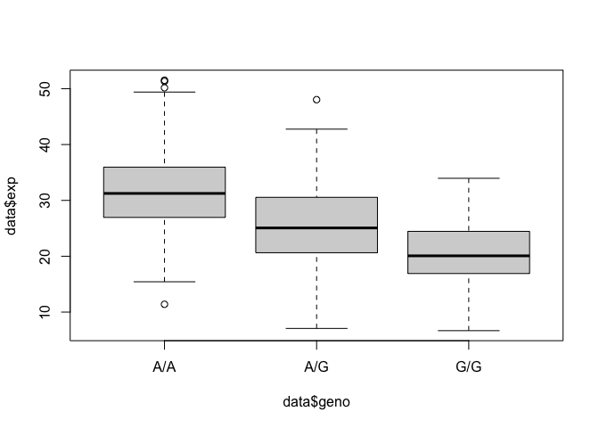

# Lab 12
Xiaoyu Lian (A17025943)

> Q13: Read this file into R and determine the sample size for each
> genotype and their corresponding median expression levels for each of
> these genotypes.

``` r
data <- read.table("rs8067378_ENSG00000172057.6.txt", header = TRUE)
```

``` r
summary (data)
```

        sample              geno                exp        
     Length:462         Length:462         Min.   : 6.675  
     Class :character   Class :character   1st Qu.:20.004  
     Mode  :character   Mode  :character   Median :25.116  
                                           Mean   :25.640  
                                           3rd Qu.:30.779  
                                           Max.   :51.518  

``` r
sample_sizes <- table(data$geno)

library(dplyr)
```


    Attaching package: 'dplyr'

    The following objects are masked from 'package:stats':

        filter, lag

    The following objects are masked from 'package:base':

        intersect, setdiff, setequal, union

``` r
median_expression <- data %>%
  group_by(geno) %>%
  summarise(median_exp = median(exp, na.rm = TRUE))

print(sample_sizes)
```


    A/A A/G G/G 
    108 233 121 

``` r
print(median_expression)
```

    # A tibble: 3 × 2
      geno  median_exp
      <chr>      <dbl>
    1 A/A         31.2
    2 A/G         25.1
    3 G/G         20.1

> Q14: Generate a boxplot with a box per genotype, what could you infer
> from the relative expression value between A/A and G/G displayed in
> this plot? Does the SNP effect the expression of ORMDL3?

``` r
boxplot(data$exp~data$geno)
```



AA expression is much more than GG expression. The SNP affects the
expression of ORMDL3 with A express much more than G.
