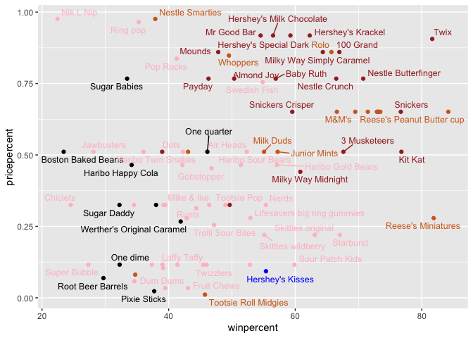

# Halloween
Xiaoyu Lian (A17025943)

## 1. Importing candy data

``` r
candy_file <- "candy-data.csv"

candy = read.csv(candy_file, row.names=1)
head(candy)
```

                 chocolate fruity caramel peanutyalmondy nougat crispedricewafer
    100 Grand            1      0       1              0      0                1
    3 Musketeers         1      0       0              0      1                0
    One dime             0      0       0              0      0                0
    One quarter          0      0       0              0      0                0
    Air Heads            0      1       0              0      0                0
    Almond Joy           1      0       0              1      0                0
                 hard bar pluribus sugarpercent pricepercent winpercent
    100 Grand       0   1        0        0.732        0.860   66.97173
    3 Musketeers    0   1        0        0.604        0.511   67.60294
    One dime        0   0        0        0.011        0.116   32.26109
    One quarter     0   0        0        0.011        0.511   46.11650
    Air Heads       0   0        0        0.906        0.511   52.34146
    Almond Joy      0   1        0        0.465        0.767   50.34755

> Q1. How many different candy types are in this dataset?

``` r
nrow(candy)
```

    [1] 85

> Q2. How many fruity candy types are in the dataset?

``` r
sum(candy$fruity)
```

    [1] 38

Different Methods

``` r
candy["Twix", ]$winpercent
```

    [1] 81.64291

``` r
candy["Twix", "winpercent"]
```

    [1] 81.64291

``` r
library(dplyr)
```


    Attaching package: 'dplyr'

    The following objects are masked from 'package:stats':

        filter, lag

    The following objects are masked from 'package:base':

        intersect, setdiff, setequal, union

``` r
candy %>% 
  filter(rownames(candy)=="Twix")%>%
  select(winpercent)
```

         winpercent
    Twix   81.64291

``` r
candy %>% 
  filter(winpercent > 50)|>
  filter(fruity == 1)
```

                                chocolate fruity caramel peanutyalmondy nougat
    Air Heads                           0      1       0              0      0
    Haribo Gold Bears                   0      1       0              0      0
    Haribo Sour Bears                   0      1       0              0      0
    Lifesavers big ring gummies         0      1       0              0      0
    Nerds                               0      1       0              0      0
    Skittles original                   0      1       0              0      0
    Skittles wildberry                  0      1       0              0      0
    Sour Patch Kids                     0      1       0              0      0
    Sour Patch Tricksters               0      1       0              0      0
    Starburst                           0      1       0              0      0
    Swedish Fish                        0      1       0              0      0
                                crispedricewafer hard bar pluribus sugarpercent
    Air Heads                                  0    0   0        0        0.906
    Haribo Gold Bears                          0    0   0        1        0.465
    Haribo Sour Bears                          0    0   0        1        0.465
    Lifesavers big ring gummies                0    0   0        0        0.267
    Nerds                                      0    1   0        1        0.848
    Skittles original                          0    0   0        1        0.941
    Skittles wildberry                         0    0   0        1        0.941
    Sour Patch Kids                            0    0   0        1        0.069
    Sour Patch Tricksters                      0    0   0        1        0.069
    Starburst                                  0    0   0        1        0.151
    Swedish Fish                               0    0   0        1        0.604
                                pricepercent winpercent
    Air Heads                          0.511   52.34146
    Haribo Gold Bears                  0.465   57.11974
    Haribo Sour Bears                  0.465   51.41243
    Lifesavers big ring gummies        0.279   52.91139
    Nerds                              0.325   55.35405
    Skittles original                  0.220   63.08514
    Skittles wildberry                 0.220   55.10370
    Sour Patch Kids                    0.116   59.86400
    Sour Patch Tricksters              0.116   52.82595
    Starburst                          0.220   67.03763
    Swedish Fish                       0.755   54.86111

``` r
top.candy <- candy[candy$winpercent>50,]
top.candy[top.candy$fruity == 1,]
```

                                chocolate fruity caramel peanutyalmondy nougat
    Air Heads                           0      1       0              0      0
    Haribo Gold Bears                   0      1       0              0      0
    Haribo Sour Bears                   0      1       0              0      0
    Lifesavers big ring gummies         0      1       0              0      0
    Nerds                               0      1       0              0      0
    Skittles original                   0      1       0              0      0
    Skittles wildberry                  0      1       0              0      0
    Sour Patch Kids                     0      1       0              0      0
    Sour Patch Tricksters               0      1       0              0      0
    Starburst                           0      1       0              0      0
    Swedish Fish                        0      1       0              0      0
                                crispedricewafer hard bar pluribus sugarpercent
    Air Heads                                  0    0   0        0        0.906
    Haribo Gold Bears                          0    0   0        1        0.465
    Haribo Sour Bears                          0    0   0        1        0.465
    Lifesavers big ring gummies                0    0   0        0        0.267
    Nerds                                      0    1   0        1        0.848
    Skittles original                          0    0   0        1        0.941
    Skittles wildberry                         0    0   0        1        0.941
    Sour Patch Kids                            0    0   0        1        0.069
    Sour Patch Tricksters                      0    0   0        1        0.069
    Starburst                                  0    0   0        1        0.151
    Swedish Fish                               0    0   0        1        0.604
                                pricepercent winpercent
    Air Heads                          0.511   52.34146
    Haribo Gold Bears                  0.465   57.11974
    Haribo Sour Bears                  0.465   51.41243
    Lifesavers big ring gummies        0.279   52.91139
    Nerds                              0.325   55.35405
    Skittles original                  0.220   63.08514
    Skittles wildberry                 0.220   55.10370
    Sour Patch Kids                    0.116   59.86400
    Sour Patch Tricksters              0.116   52.82595
    Starburst                          0.220   67.03763
    Swedish Fish                       0.755   54.86111

## 2. What is your favorate candy? \> Q3. What is your favorite candy in the dataset and what is it’s winpercent value?

``` r
candy["Almond Joy", ]$winpercent
```

    [1] 50.34755

> Q4. What is the winpercent value for “Kit Kat”?

``` r
candy["Kit Kat", ]$winpercent
```

    [1] 76.7686

> Q5. What is the winpercent value for “Tootsie Roll Snack Bars”?

``` r
candy["Tootsie Roll Snack Bars", ]$winpercent
```

    [1] 49.6535

``` r
library("skimr")
skim(candy)
```

|                                                  |       |
|:-------------------------------------------------|:------|
| Name                                             | candy |
| Number of rows                                   | 85    |
| Number of columns                                | 12    |
| \_\_\_\_\_\_\_\_\_\_\_\_\_\_\_\_\_\_\_\_\_\_\_   |       |
| Column type frequency:                           |       |
| numeric                                          | 12    |
| \_\_\_\_\_\_\_\_\_\_\_\_\_\_\_\_\_\_\_\_\_\_\_\_ |       |
| Group variables                                  | None  |

Data summary

**Variable type: numeric**

| skim_variable | n_missing | complete_rate | mean | sd | p0 | p25 | p50 | p75 | p100 | hist |
|:---|---:|---:|---:|---:|---:|---:|---:|---:|---:|:---|
| chocolate | 0 | 1 | 0.44 | 0.50 | 0.00 | 0.00 | 0.00 | 1.00 | 1.00 | ▇▁▁▁▆ |
| fruity | 0 | 1 | 0.45 | 0.50 | 0.00 | 0.00 | 0.00 | 1.00 | 1.00 | ▇▁▁▁▆ |
| caramel | 0 | 1 | 0.16 | 0.37 | 0.00 | 0.00 | 0.00 | 0.00 | 1.00 | ▇▁▁▁▂ |
| peanutyalmondy | 0 | 1 | 0.16 | 0.37 | 0.00 | 0.00 | 0.00 | 0.00 | 1.00 | ▇▁▁▁▂ |
| nougat | 0 | 1 | 0.08 | 0.28 | 0.00 | 0.00 | 0.00 | 0.00 | 1.00 | ▇▁▁▁▁ |
| crispedricewafer | 0 | 1 | 0.08 | 0.28 | 0.00 | 0.00 | 0.00 | 0.00 | 1.00 | ▇▁▁▁▁ |
| hard | 0 | 1 | 0.18 | 0.38 | 0.00 | 0.00 | 0.00 | 0.00 | 1.00 | ▇▁▁▁▂ |
| bar | 0 | 1 | 0.25 | 0.43 | 0.00 | 0.00 | 0.00 | 0.00 | 1.00 | ▇▁▁▁▂ |
| pluribus | 0 | 1 | 0.52 | 0.50 | 0.00 | 0.00 | 1.00 | 1.00 | 1.00 | ▇▁▁▁▇ |
| sugarpercent | 0 | 1 | 0.48 | 0.28 | 0.01 | 0.22 | 0.47 | 0.73 | 0.99 | ▇▇▇▇▆ |
| pricepercent | 0 | 1 | 0.47 | 0.29 | 0.01 | 0.26 | 0.47 | 0.65 | 0.98 | ▇▇▇▇▆ |
| winpercent | 0 | 1 | 50.32 | 14.71 | 22.45 | 39.14 | 47.83 | 59.86 | 84.18 | ▃▇▆▅▂ |

> Q6. Is there any variable/column that looks to be on a different scale
> to the majority of the other columns in the dataset?

The winpercent has different scale. It has a mean at 50.32, but others
are below 1. Remember to scale data before PCA.

> Q7. What do you think a zero and one represent for the
> candy\$chocolate column?

It means True or false, that whether the candy contains chocolate.

> Q8. Plot a histogram of winpercent values

``` r
hist(candy$winpercent, breaks = 10)
```


``` r
library(ggplot2)

ggplot(candy)+ 
  aes(candy$winpercent)+
  geom_histogram(binwidth = 8)+
  theme_bw()
```

    Warning: Use of `candy$winpercent` is discouraged.
    ℹ Use `winpercent` instead.


> Q9. Is the distribution of winpercent values symmetrical?

No

> Q10. Is the center of the distribution above or below 50%?

``` r
summary(candy$winpercent)
```

       Min. 1st Qu.  Median    Mean 3rd Qu.    Max. 
      22.45   39.14   47.83   50.32   59.86   84.18 

below 50% \>Q11. On average is chocolate candy higher or lower ranked
than fruit candy?

``` r
chocolate_avg <- mean(candy$winpercent[as.logical(candy$chocolate)], na.rm = TRUE)

fruit_avg <- mean(candy$winpercent[as.logical(candy$fruity)], na.rm = TRUE)

chocolate_avg
```

    [1] 60.92153

``` r
fruit_avg
```

    [1] 44.11974

> Q12. Is this difference statistically significant?

``` r
t_test_result <- t.test(candy$winpercent[as.logical(candy$chocolate)],
                        candy$winpercent[as.logical(candy$fruity)])
t_test_result
```


        Welch Two Sample t-test

    data:  candy$winpercent[as.logical(candy$chocolate)] and candy$winpercent[as.logical(candy$fruity)]
    t = 6.2582, df = 68.882, p-value = 2.871e-08
    alternative hypothesis: true difference in means is not equal to 0
    95 percent confidence interval:
     11.44563 22.15795
    sample estimates:
    mean of x mean of y 
     60.92153  44.11974 

Alternative Way

``` r
chocolate <- candy |>
  filter(chocolate == 1)
mean(chocolate$winpercent)
```

    [1] 60.92153

``` r
fruit <- candy |>
  filter(fruity == 1)
mean(fruit$winpercent)
```

    [1] 44.11974

``` r
t_test <- t.test(chocolate$winpercent,fruit$winpercent)
```

## 3. Overall Candy Rankings

`sort` function. If use sort, can sort the value, but lost the
identification of the candy

``` r
play <- c("c","d","a")
sort(play)
```

    [1] "a" "c" "d"

``` r
order(play)
```

    [1] 3 1 2

``` r
play[order(play)]
```

    [1] "a" "c" "d"

> Q13. What are the five least liked candy types in this set?

``` r
library(dplyr)
candy %>% arrange(winpercent) %>% head(5)
```

                       chocolate fruity caramel peanutyalmondy nougat
    Nik L Nip                  0      1       0              0      0
    Boston Baked Beans         0      0       0              1      0
    Chiclets                   0      1       0              0      0
    Super Bubble               0      1       0              0      0
    Jawbusters                 0      1       0              0      0
                       crispedricewafer hard bar pluribus sugarpercent pricepercent
    Nik L Nip                         0    0   0        1        0.197        0.976
    Boston Baked Beans                0    0   0        1        0.313        0.511
    Chiclets                          0    0   0        1        0.046        0.325
    Super Bubble                      0    0   0        0        0.162        0.116
    Jawbusters                        0    1   0        1        0.093        0.511
                       winpercent
    Nik L Nip            22.44534
    Boston Baked Beans   23.41782
    Chiclets             24.52499
    Super Bubble         27.30386
    Jawbusters           28.12744

``` r
head(candy[order(candy$winpercent),], n=5)
```

                       chocolate fruity caramel peanutyalmondy nougat
    Nik L Nip                  0      1       0              0      0
    Boston Baked Beans         0      0       0              1      0
    Chiclets                   0      1       0              0      0
    Super Bubble               0      1       0              0      0
    Jawbusters                 0      1       0              0      0
                       crispedricewafer hard bar pluribus sugarpercent pricepercent
    Nik L Nip                         0    0   0        1        0.197        0.976
    Boston Baked Beans                0    0   0        1        0.313        0.511
    Chiclets                          0    0   0        1        0.046        0.325
    Super Bubble                      0    0   0        0        0.162        0.116
    Jawbusters                        0    1   0        1        0.093        0.511
                       winpercent
    Nik L Nip            22.44534
    Boston Baked Beans   23.41782
    Chiclets             24.52499
    Super Bubble         27.30386
    Jawbusters           28.12744

> Q14. What are the top 5 all time favorite candy types out of this set?

``` r
library(dplyr)
-candy %>% arrange(winpercent) %>% head(5)
```

                              chocolate fruity caramel peanutyalmondy nougat
    Reese's Peanut Butter cup        -1      0       0             -1      0
    Reese's Miniatures               -1      0       0             -1      0
    Twix                             -1      0      -1              0      0
    Kit Kat                          -1      0       0              0      0
    Snickers                         -1      0      -1             -1     -1
                              crispedricewafer hard bar pluribus sugarpercent
    Reese's Peanut Butter cup                0    0   0        0       -0.720
    Reese's Miniatures                       0    0   0        0       -0.034
    Twix                                    -1    0  -1        0       -0.546
    Kit Kat                                 -1    0  -1        0       -0.313
    Snickers                                 0    0  -1        0       -0.546
                              pricepercent winpercent
    Reese's Peanut Butter cup       -0.651  -84.18029
    Reese's Miniatures              -0.279  -81.86626
    Twix                            -0.906  -81.64291
    Kit Kat                         -0.511  -76.76860
    Snickers                        -0.651  -76.67378

``` r
head(candy[order(candy$winpercent, decreasing = T),], n=5)
```

                              chocolate fruity caramel peanutyalmondy nougat
    Reese's Peanut Butter cup         1      0       0              1      0
    Reese's Miniatures                1      0       0              1      0
    Twix                              1      0       1              0      0
    Kit Kat                           1      0       0              0      0
    Snickers                          1      0       1              1      1
                              crispedricewafer hard bar pluribus sugarpercent
    Reese's Peanut Butter cup                0    0   0        0        0.720
    Reese's Miniatures                       0    0   0        0        0.034
    Twix                                     1    0   1        0        0.546
    Kit Kat                                  1    0   1        0        0.313
    Snickers                                 0    0   1        0        0.546
                              pricepercent winpercent
    Reese's Peanut Butter cup        0.651   84.18029
    Reese's Miniatures               0.279   81.86626
    Twix                             0.906   81.64291
    Kit Kat                          0.511   76.76860
    Snickers                         0.651   76.67378

> Q15. Make a first barplot of candy ranking based on winpercent values.

``` r
library(ggplot2)

ggplot(candy) + 
  aes(winpercent, rownames(candy)) +
  geom_col()
```


> Q16. This is quite ugly, use the reorder() function to get the bars
> sorted by winpercent?

``` r
ggplot(candy) + 
  aes(winpercent, reorder(rownames(candy),winpercent))+
  #-winpercent will make the order flip
  geom_col()
```


``` r
#only tells the chocolate, not enough
#ggplot(candy) + 
  #aes(winpercent, reorder(rownames(candy),winpercent), fill = chocolate)+
  #geom_col()
```

a more customized color scheme that tells chocolate, bars, and fruity
etc. all from the one plot

``` r
#place holder color vector, repeat, for those doesn't belong to the three divisions
my_cols=rep("black", nrow(candy))
#overwrite those 
my_cols[as.logical(candy$chocolate)] = "chocolate"
my_cols[as.logical(candy$bar)] = "brown"
my_cols[as.logical(candy$fruity)] = "pink"
```

``` r
#use blue for the favorite candy
my_cols[rownames (candy) == "Hershey's Kisses"] <- "blue"
```

``` r
ggplot(candy) + 
  aes(winpercent, reorder(rownames(candy),winpercent)) +
  geom_col(fill=my_cols) 
```


> Q17. What is the worst ranked chocolate candy?

sixlets

> Q18. What is the best ranked fruity candy?

Starburst

## 4. Taking a look at pricepercent

``` r
library(ggrepel)

# How about a plot of price vs win
ggplot(candy) +
  aes(winpercent, pricepercent, label=rownames(candy)) +
  geom_point(col=my_cols) + 
  geom_text_repel(col=my_cols, size=3.3, max.overlaps = 8)
```

    Warning: ggrepel: 21 unlabeled data points (too many overlaps). Consider
    increasing max.overlaps



``` r
#higher value gives more overlap, lower gives less overlap
```

> Q19. Which candy type is the highest ranked in terms of winpercent for
> the least money - i.e. offers the most bang for your buck?

Reese’s Miniature

> Q20. What are the top 5 most expensive candy types in the dataset and
> of these which is the least popular?

Nik L Nip, Nestle Smarties, Ring pop, Hershey’s Krackel, Hershey’s Milk
Chocolate Least popular: Nik L Nip

``` r
ord <- order(candy$pricepercent, decreasing = TRUE)
top5 <- head( candy[ord,c(11,12)], n=5 )
top5
```

                             pricepercent winpercent
    Nik L Nip                       0.976   22.44534
    Nestle Smarties                 0.976   37.88719
    Ring pop                        0.965   35.29076
    Hershey's Krackel               0.918   62.28448
    Hershey's Milk Chocolate        0.918   56.49050

``` r
top5[which.min(top5$winpercent),]
```

              pricepercent winpercent
    Nik L Nip        0.976   22.44534

> Q21. Make a barplot again with geom_col() this time using pricepercent
> and then improve this step by step, first ordering the x-axis by value
> and finally making a so called “dot chat” or “lollipop” chart by
> swapping geom_col() for geom_point() + geom_segment().

``` r
ggplot(candy) +
  aes(pricepercent, reorder(rownames(candy), pricepercent)) +
  geom_segment(aes(yend = reorder(rownames(candy), pricepercent), 
                   xend = 0), col="gray40") +
    geom_point()
```


## 5. Exploring the correlation structure

``` r
library(corrplot)
```

    corrplot 0.95 loaded

``` r
cij <- cor(candy)
corrplot(cij, diag = F) #type = "lower"
```


``` r
#type example() in the console can get the example for the function
```

> Q22. Examining this plot what two variables are anti-correlated
> (i.e. have minus values)?

fruity and chocolate

> Q23. Similarly, what two variables are most positively correlated?

bar and chocolate, chocolate and winpercent

## 6. Principal Component Analysis

``` r
pca <- prcomp(candy, scale = T)
summary(pca)
```

    Importance of components:
                              PC1    PC2    PC3     PC4    PC5     PC6     PC7
    Standard deviation     2.0788 1.1378 1.1092 1.07533 0.9518 0.81923 0.81530
    Proportion of Variance 0.3601 0.1079 0.1025 0.09636 0.0755 0.05593 0.05539
    Cumulative Proportion  0.3601 0.4680 0.5705 0.66688 0.7424 0.79830 0.85369
                               PC8     PC9    PC10    PC11    PC12
    Standard deviation     0.74530 0.67824 0.62349 0.43974 0.39760
    Proportion of Variance 0.04629 0.03833 0.03239 0.01611 0.01317
    Cumulative Proportion  0.89998 0.93832 0.97071 0.98683 1.00000

``` r
plot(pca$x[,1:2])
```


``` r
plot(pca$x[,1:2], col=my_cols, pch=16)
```


how to do the original varibales columns contribute to the new PCs. I
will look at PC1

``` r
loadings <- as.data.frame(pca$rotation)
ggplot(loadings)+
  aes(PC1, reorder(rownames(loadings), PC1), fill = PC1)+
  geom_col()
```


``` r
# Make a new data-frame with our PCA results and candy data
my_data <- cbind(candy, pca$x[,1:3])
```

``` r
p <- ggplot(my_data) + 
        aes(x=PC1, y=PC2, 
            size=winpercent/100,  
            text=rownames(my_data),
            label=rownames(my_data)) +
        geom_point(col=my_cols)
p
```


``` r
library(ggrepel)

p + geom_text_repel(size=3.3, col=my_cols, max.overlaps = 8)  + 
  theme(legend.position = "none") +
  labs(title="Halloween Candy PCA Space",
       subtitle="Colored by type: chocolate bar (dark brown), chocolate other (light brown), fruity (red), other (black)",
       caption="Data from 538")
```

    Warning: ggrepel: 34 unlabeled data points (too many overlaps). Consider
    increasing max.overlaps


``` r
#library(plotly)
#ggplotly(p)
```

``` r
par(mar=c(8,4,2,2))
barplot(pca$rotation[,1], las=2, ylab="PC1 Contribution")
```


> Q24. What original variables are picked up strongly by PC1 in the
> positive direction? Do these make sense to you?

The fruity, hard, and pluribus are picked up strongly.Yes, because they
are correlated to each others
