# Lab 7
Xiaoyu Lian (A17025943)

Today we are going to learn how to apply different machine learning
methods, beginning with clustering:

The goal here is to find groups/ clusters in your input data

first I will make up some data with clear groups. For this I will use
the `rnorm()` function:

``` r
rnorm(10)
```

     [1]  0.14997639  0.33768147  0.70312123 -0.35630738  0.62313178 -0.01983377
     [7]  0.22042941 -0.71299710 -0.22409450  3.06133010

``` r
hist(rnorm(10000, mean = 3))
```

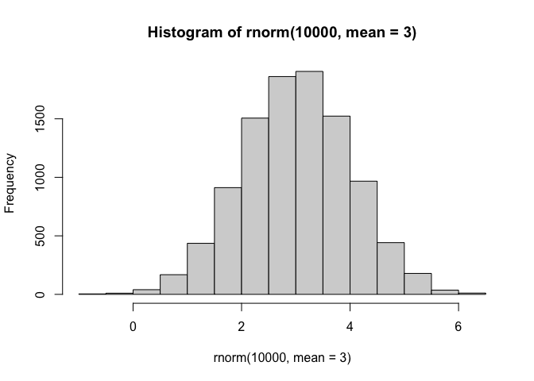

``` r
a <- hist(c(rnorm(10000,3),
       rnorm(10000,-3)))
```

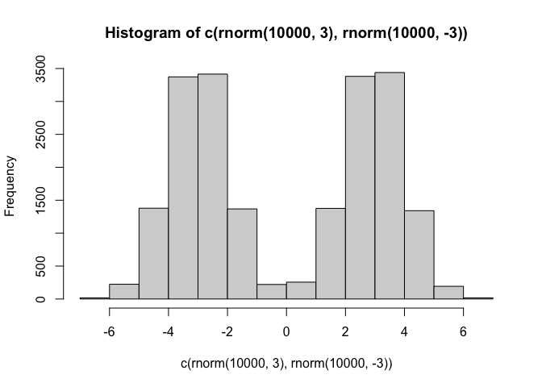

``` r
a
```

    $breaks
     [1] -7 -6 -5 -4 -3 -2 -1  0  1  2  3  4  5  6  7

    $counts
     [1]   17  224 1379 3373 3415 1368  221  256 1376 3381 3439 1341  193   17

    $density
     [1] 0.00085 0.01120 0.06895 0.16865 0.17075 0.06840 0.01105 0.01280 0.06880
    [10] 0.16905 0.17195 0.06705 0.00965 0.00085

    $mids
     [1] -6.5 -5.5 -4.5 -3.5 -2.5 -1.5 -0.5  0.5  1.5  2.5  3.5  4.5  5.5  6.5

    $xname
    [1] "c(rnorm(10000, 3), rnorm(10000, -3))"

    $equidist
    [1] TRUE

    attr(,"class")
    [1] "histogram"

``` r
n <- 30
x <- c(rnorm(n,3), rnorm (n, -3))
y<- rev(x)
z<- cbind(x,y)
head(z)
```

                x         y
    [1,] 1.252974 -3.846776
    [2,] 3.303668 -4.992640
    [3,] 1.687913 -3.401818
    [4,] 2.853421 -1.781833
    [5,] 4.357372 -2.802077
    [6,] 4.451147 -2.909044

``` r
hist(z)
```

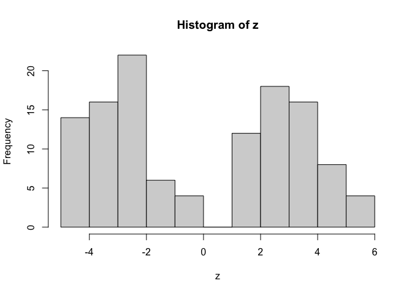

Use the `kmeans()` function setting k to 2 and nstart = 20 inspect the
results \>Q. How many points are in each cluster \>Q. What ’component’of
your result object details - cluster size - cluster assignment - cluster
mist

plot x colored by the kmeans cluster assignment and add cluster centers
as blue points

``` r
km <- kmeans(z, centers = 2)
km
```

    K-means clustering with 2 clusters of sizes 30, 30

    Cluster means:
              x         y
    1 -3.056468  2.899479
    2  2.899479 -3.056468

    Clustering vector:
     [1] 2 2 2 2 2 2 2 2 2 2 2 2 2 2 2 2 2 2 2 2 2 2 2 2 2 2 2 2 2 2 1 1 1 1 1 1 1 1
    [39] 1 1 1 1 1 1 1 1 1 1 1 1 1 1 1 1 1 1 1 1 1 1

    Within cluster sum of squares by cluster:
    [1] 72.26992 72.26992
     (between_SS / total_SS =  88.0 %)

    Available components:

    [1] "cluster"      "centers"      "totss"        "withinss"     "tot.withinss"
    [6] "betweenss"    "size"         "iter"         "ifault"      

Results in kmeans object `km`

``` r
attributes(km)
```

    $names
    [1] "cluster"      "centers"      "totss"        "withinss"     "tot.withinss"
    [6] "betweenss"    "size"         "iter"         "ifault"      

    $class
    [1] "kmeans"

cluster size

``` r
km$totss
```

    [1] 1208.739

number of points in each cluster

``` r
km$size
```

    [1] 30 30

cluster assignment / membership

``` r
km$cluster
```

     [1] 2 2 2 2 2 2 2 2 2 2 2 2 2 2 2 2 2 2 2 2 2 2 2 2 2 2 2 2 2 2 1 1 1 1 1 1 1 1
    [39] 1 1 1 1 1 1 1 1 1 1 1 1 1 1 1 1 1 1 1 1 1 1

> Q. plot z colored by the kmeans cluster assignment and add cluster
> centers as blue points

It will recluse the shorter color vector to be the same length as the
larger (numbers of data point in z)

``` r
plot(z, col = c("red","blue"))
```

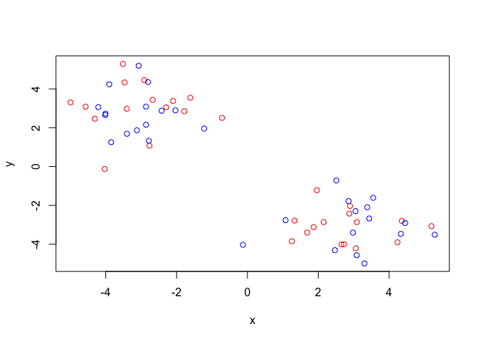

``` r
plot(z, col = km$cluster)
```

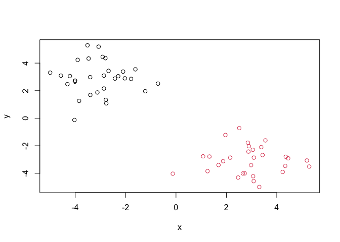

We can use the `points()` function to add new points to an existing
plot…like the cluster centers 　

``` r
plot(z, col = km$cluster)
points(km$centers, col = "blue", pch = 15, cex = 3)
```

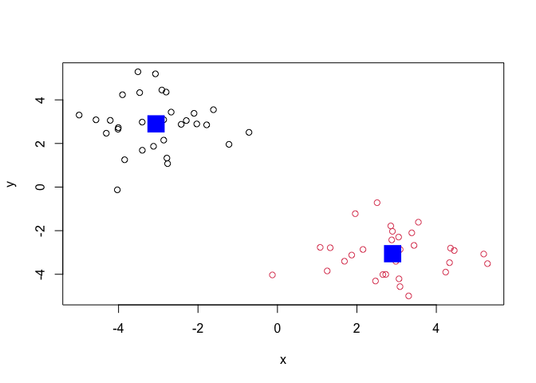

> Q. Can you run kmeans and ask for 4 clusters please and plot the
> results like we have done above?

``` r
km2 <- kmeans(z, centers = 4)
plot(z, col = km2$cluster)
points(km2$centers, col = "blue", pch = 15)
```

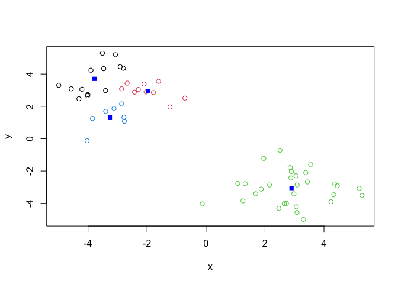

## Hierarchical Clustering

Let’s take our some made-up data `z` and see how cluster work

first we need a distance matrix of our data to be clustered

``` r
d <- dist(z)
hc <- hclust(d)
hc
```


    Call:
    hclust(d = d)

    Cluster method   : complete 
    Distance         : euclidean 
    Number of objects: 60 

``` r
plot(hc)
abline(h = 3, col = "red")
```

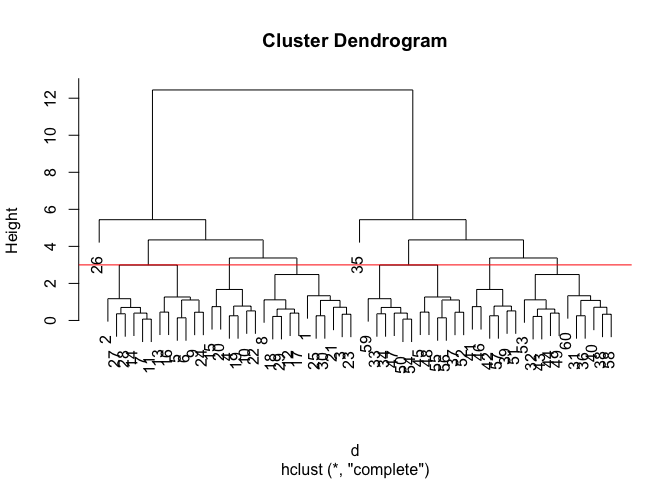

I can get my cluster membership vector by “cutting the tree” with the
`cutree()` function

``` r
grps <- cutree(hc, h = 8)
```

Can you plot `z` colored by our hclust results:

``` r
plot(z, col = grps)
```

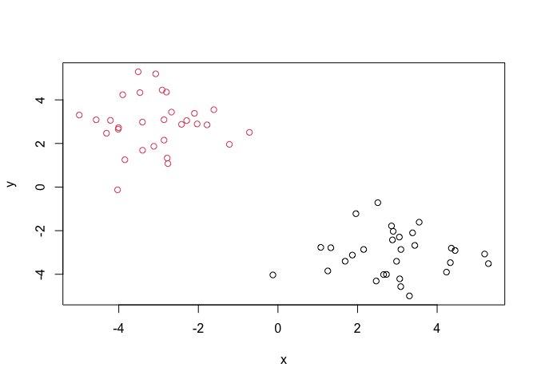

> Q1. How many rows and columns are in your new data frame named x? What
> R functions could you use to answer this questions? Q2. Which approach
> to solving the ‘row-names problem’ mentioned above do you prefer and
> why? Is one approach more robust than another under certain
> circumstances?

``` r
url <- "https://tinyurl.com/UK-foods"
x <- read.csv(url, row.names = 1)
```

``` r
dim(x)
```

    [1] 17  4

``` r
head(x)
```

                   England Wales Scotland N.Ireland
    Cheese             105   103      103        66
    Carcass_meat       245   227      242       267
    Other_meat         685   803      750       586
    Fish               147   160      122        93
    Fats_and_oils      193   235      184       209
    Sugars             156   175      147       139

``` r
barplot(as.matrix(x), beside=T, col=rainbow(nrow(x)))
```


> Q3: Changing what optional argument in the above barplot() function
> results in the following plot?

``` r
barplot(as.matrix(x), beside=F, col=rainbow(nrow(x)))
```


A so-called “Pairs” plot can be useful for small datasets like this one
\>Q5: Generating all pairwise plots may help somewhat. Can you make
sense of the following code and resulting figure? What does it mean if a
given point lies on the diagonal for a given plot?

``` r
pairs(x, col=rainbow(10), pch=16)
```


``` r
#Country name is the x-axis for all the graphs in that colomn
```

It is hard to see structure and trends in even this small data set. How
will we ever do this when we have big data set with 1000s or 10s of
thousands of things we are measuring…

\###PCA to Rescue

Lets see how PCA deals with this dataset. So main function in base R to
do PCA is called `prcomp()`

``` r
pca <- prcomp(t(x))
summary(pca)
```

    Importance of components:
                                PC1      PC2      PC3       PC4
    Standard deviation     324.1502 212.7478 73.87622 2.921e-14
    Proportion of Variance   0.6744   0.2905  0.03503 0.000e+00
    Cumulative Proportion    0.6744   0.9650  1.00000 1.000e+00

Let’s see what is inside this `pca` object that we created from running
`prcomp()`

``` r
attributes(pca)
```

    $names
    [1] "sdev"     "rotation" "center"   "scale"    "x"       

    $class
    [1] "prcomp"

``` r
pca$x
```

                     PC1         PC2        PC3           PC4
    England   -144.99315   -2.532999 105.768945 -9.152022e-15
    Wales     -240.52915 -224.646925 -56.475555  5.560040e-13
    Scotland   -91.86934  286.081786 -44.415495 -6.638419e-13
    N.Ireland  477.39164  -58.901862  -4.877895  1.329771e-13

``` r
plot(pca$x[,1], pca$x[,2], col = c("black", "red", "blue", "green"), pch = 16,
     xlab = "PC1", ylab = "PC2")
```

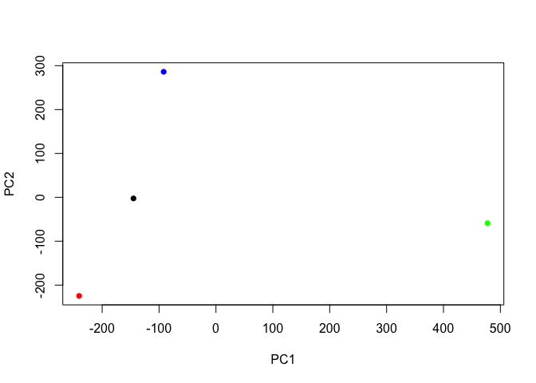

``` r
plot(pca$x[,1], pca$x[,2], col = c("black", "red", "blue", "green"),
     xlab = "PC1", ylab = "PC2")
text(pca$x[,1], pca$x[,2], colnames(x), col = c("black", "red", "blue", "green"))
```

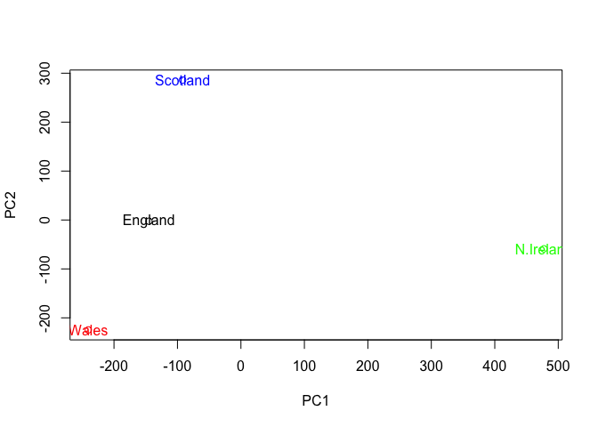

``` r
v <- round( pca$sdev^2/sum(pca$sdev^2) * 100 )
v
```

    [1] 67 29  4  0

``` r
z <- summary(pca)
z$importance
```

                                 PC1       PC2      PC3          PC4
    Standard deviation     324.15019 212.74780 73.87622 2.921348e-14
    Proportion of Variance   0.67444   0.29052  0.03503 0.000000e+00
    Cumulative Proportion    0.67444   0.96497  1.00000 1.000000e+00

``` r
barplot(v, xlab="Principal Component", ylab="Percent Variation")
```


``` r
## Lets focus on PC1 as it accounts for > 90% of variance 
par(mar=c(10, 3, 0.35, 0))
barplot( pca$rotation[,1], las=2 )
```


